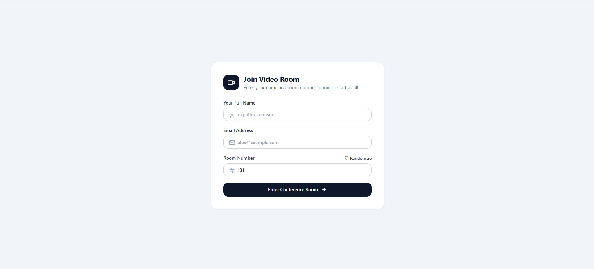
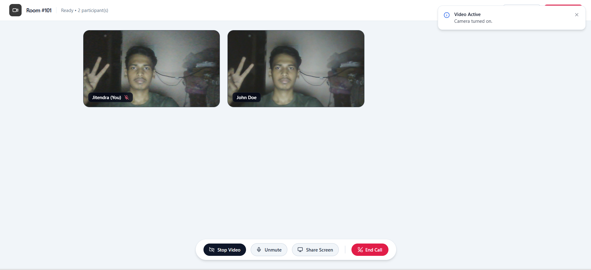

# SFU WebRTC Group Video Calling Application

A production-ready, high-performance Selective Forwarding Unit (SFU) multi-party video calling platform built with **Mediasoup (C++ WebRTC core)**, **Node.js / Express**, **Socket.io**, and **React + Vite (TypeScript & Tailwind CSS)**.

> **Full Technical Documentation & API Reference**: See [DOCS.md](./DOCS.md) for sequence diagrams, Socket.io protocol specifications, and deployment guides.

---

## Table of Contents
- [1. Overview & Key Features](#1-overview--key-features)
- [2. User Interface & Screenshots](#2-user-interface--screenshots)
- [3. Why SFU? (Mesh vs MCU vs SFU)](#3-why-sfu-mesh-vs-mcu-vs-sfu)
- [4. Mediasoup SFU Architecture](#4-mediasoup-sfu-architecture)
- [5. Media Negotiation & Signaling Flow](#5-media-negotiation--signaling-flow)
- [6. Project Structure](#6-project-structure)
- [7. Getting Started](#7-getting-started)
- [8. Configuration & Environment Variables](#8-configuration--environment-variables)
- [9. Tech Stack & Credits](#9-tech-stack--credits)

---

## 1. Overview & Key Features

Most standard WebRTC tutorials demonstrate simple Peer-to-Peer (P2P Mesh) video calling. While P2P works well for 1-on-1 calls, it quickly breaks down when 3 or more people join:
- In a 5-person mesh call, each client must upload their video 4 times ($N - 1$) and download 4 video streams.
- For 8 participants, each user sends 7 video streams and receives 7 streams—causing network chokes, CPU heating, and dropped frames.

This application implements a **Selective Forwarding Unit (SFU)**:
1. **Single Uplink**: Every participant sends their video and audio to the media server **exactly once**.
2. **Selective Forwarding**: The server forwards incoming encrypted RTP packets to all other participants in the room without decoding or re-encoding.
3. **Ultra-Low Latency & High Scalability**: Drastically cuts client bandwidth requirements and eliminates server-side video transcoding overhead.
4. **Resilient Reconnection Sync**: Handles socket re-connects, participant page reloads, and media track additions dynamically without breaking remote video streams.
5. **Real-time Error Popups**: Global toast notification system (`toastStore.ts`) providing immediate feedback on media permissions, network drops, and room status.
6. **Direct URL Join Fallback**: Modal guest prompt allowing users to enter names and join directly via shared room links (`/room/:id`).

---

## 2. User Interface & Screenshots

### Entry Lobby
Clean entry interface for entering full name, email address, and room number:



### Multi-Party Conference Room
Responsive video layout with connection indicators, local/remote video tiles, camera-off placeholders, and bottom control bar (*Start Video*, *Mute*, *Share Screen*, *Leave Call*):



---

## 3. Why SFU? (Mesh vs MCU vs SFU)

```
      MESH (P2P)                     MCU (Multipoint)                    SFU (Selective Forwarding)

     [A] <---> [B]                     [A]      [B]                       [A]      [B]
       \       /                         \      /                           \      /
        \     /                           v    v                             v    v
         \   /                         +----------+                       +----------+
          [C]                          | Transcode|                       | Forward  |
                                       | & Mix    |                       | Packets  |
   N*(N-1) connections                 +----------+                       +----------+
   High Client Uplink                       |                                  |    |
   Fails at >4 peers                        v                                  v    v
                                      Single Stream                      Separate Streams
                                     High Server CPU                     Low Server CPU & Bandwidth
```

| Metric | Peer-to-Peer (Mesh) | Multipoint Control Unit (MCU) | Selective Forwarding Unit (SFU) |
| :--- | :--- | :--- | :--- |
| **Client Upload** | $N - 1$ streams (Severe) | 1 stream (Optimal) | **1 stream (Optimal)** |
| **Client Download** | $N - 1$ streams | 1 mixed stream | **$N - 1$ individual streams** |
| **Server CPU Usage**| Zero (No media server) | **Extremely High** (Decodes & encodes video) | **Very Low** (Routes raw network packets) |
| **Latency** | Direct (Sub-50ms) | High (>250ms due to transcoding) | **Ultra-Low (<80ms forwarding)** |
| **Layout Control** | Client-side flexible | Rigid (Server hardcodes layout) | **Full client-side layout control** |

---

## 4. Mediasoup SFU Architecture

Mediasoup acts as a low-level, high-throughput media routing library written in C++ and controlled from Node.js via inter-process pipes.

```
+-------------------------------------------------------------------------------+
|                                Node.js Host                                   |
|                                                                               |
|  +-------------------------------------------------------------------------+  |
|  | Mediasoup Worker (Runs on a single CPU core in C++)                     |  |
|  |                                                                         |  |
|  |   +------------------------------------------------------------------+  |  |
|  |   | Router (Media boundary / Room)                                   |  |  |
|  |   |                                                                  |  |  |
|  |   |   WebRtcTransport (Send) <--- WebRTC/ICE/DTLS <--- Client A      |  |  |
|  |   |     +-- Producer (Video Track)                                   |  |  |
|  |   |     +-- Producer (Audio Track)                                   |  |  |
|  |   |                                                                  |  |  |
|  |   |   WebRtcTransport (Recv) ---> WebRTC/ICE/DTLS ---> Client B      |  |  |
|  |   |     +-- Consumer (for Client A's Video)                          |  |  |
|  |   |     +-- Consumer (for Client A's Audio)                          |  |  |
|  |   +------------------------------------------------------------------+  |  |
|  +-------------------------------------------------------------------------+  |
+-------------------------------------------------------------------------------+
```

### Core Primitives:
- **Worker**: A native OS process bound to a CPU core. To maximize throughput, the server pools multiple workers across available CPU cores.
- **Router**: An independent RTP routing entity (maps to a video call room). Codecs (VP8, H.264, Opus) are negotiated at the router level.
- **WebRtcTransport**: An ICE + DTLS connection representing a WebRTC peer connection. Each client establishes:
  - **One Send Transport**: Dedicated for all outgoing media tracks (camera, mic, screen share).
  - **One Recv Transport**: Dedicated for consuming all incoming media tracks from other peers.
- **Producer**: An incoming RTP stream published by a client to the SFU router.
- **Consumer**: An outgoing RTP stream dispatched from the SFU router to a receiving client.

---

## 5. Media Negotiation & Signaling Flow

The WebRTC state machine coordinates between the browser and Mediasoup via Socket.io:

```
 Client (Browser)                           SFU Server (Node + Mediasoup)
        |                                                 |
        |--- 1. socket.emit("join", { Room, name }) ------>|
        |<-- 2. socket.emit("routerCapabilities", rtp) ---|
        |                                                 |
        |--- 3. socket.emit("createTransport", send) ---->| (Server creates Send Transport)
        |<-- 4. returns { id, iceParams, dtlsParams } ----|
        |                                                 |
        |--- 5. sendTransport.produce({ track }) -------->| (Transmits DTLS parameters)
        |<-- 6. returns { id: producerId } ---------------|
        |                                                 |
        |                                                 |--- 7. socket.to(room).emit("newProducer") ---> (Other Peers)
        |                                                 |
        |--- 8. socket.emit("createTransport", recv) ---->| (Server creates Recv Transport)
        |<-- 9. returns { id, iceParams, dtlsParams } ----|
        |                                                 |
        |--- 10. socket.emit("consume", { producerId }) ->| (Server creates Consumer)
        |<-- 11. returns { id, kind, rtpParameters } -----|
        |                                                 |
        |--- 12. socket.emit("resumeConsumer") ---------->| (Server starts forwarding RTP packets)
        |                                                 |
```

---

## 6. Project Structure

```
.
├── backend/                     # Node.js + TypeScript Mediasoup SFU Server
│   ├── index.ts                 # Server entry point & periodic CPU/memory telemetry
│   ├── package.json
│   ├── tsconfig.json
│   ├── mediasoup/
│   │   ├── config.ts            # Dynamic LAN IP detection, port ranges, VP8/H.264/Opus codecs
│   │   └── worker.ts            # Worker process pool manager & core distribution
│   └── ws/
│       └── socket.ts            # Socket.io signaling & WebRTC transport/producer/consumer handlers
│
└── frontend/                    # React + Vite (TypeScript & Tailwind CSS)
    ├── package.json
    ├── vite.config.ts
    ├── tailwind.config.js
    ├── public/
    │   ├── Lobby.png            # Lobby UI preview image
    │   └── Room.png             # Room UI preview image
    └── src/
        ├── App.tsx              # React Router setup & global ToastContainer
        ├── main.tsx
        ├── index.css            # Tailwind directives
        ├── components/
        │   └── ToastContainer.tsx # Global error & status toast popup notifications
        ├── lib/
        │   ├── store.ts         # Zustand store with sessionStorage persistence
        │   └── toastStore.ts    # Global toast state manager
        └── pages/
            ├── Lobby.tsx        # Clean entry lobby for room no, name, and email
            └── Room.tsx         # Multi-party video grid, mic/cam toggles, screen share, and leave call
```

---

## 7. Getting Started

### Prerequisites
- **Node.js**: v18.0.0 or higher (v20+ recommended).
- **C++ Build Tools**: Mediasoup compiles native worker binaries:
  - **Windows**: Visual Studio C++ Build Tools (`npm install -g windows-build-tools` or install via Visual Studio Installer).
  - **macOS**: Xcode Command Line Tools (`xcode-select --install`).
  - **Linux**: `build-essential`, `python3`, `gcc`, `g++`.

---

### 1. Setup and Run Backend

```bash
# Navigate to backend
cd backend

# Install dependencies
npm install

# Run backend dev server with nodemon + ts-node
npm run dev
```

*The server will start on `http://localhost:3000`, detect your local network IP, and spawn Mediasoup workers.*

---

### 2. Setup and Run Frontend

In a new terminal:

```bash
# Navigate to frontend
cd frontend

# Install dependencies
npm install

# Start Vite dev server
npm run dev
```

*The client web application will start on `http://localhost:5173`.*

---

### 3. Testing Multi-Party Calling
1. Open `http://localhost:5173` in your browser.
2. Enter your Name (e.g. `Alice`), Room Number `101`, and an Email.
3. Click **Enter Conference Room**.
4. Open a **second tab** or an **Incognito window** at `http://localhost:5173`.
5. Enter a different name (e.g. `Bob`), enter the **same Room Number `101`**, and click Join Room.
6. Both participants will see each other's live video stream with real-time audio!
7. Use the bottom control bar to toggle your Camera, mute/unmute your Microphone, or share your screen.

---

## 8. Configuration & Environment Variables

Create a `.env` file in `backend/` to customize network settings:

```env
# Port for HTTP & WebSocket server (default: 3000)
PORT=3000

# WebRTC Announced IP (default: auto-detected non-internal IPv4 LAN address)
# If deploying to AWS, GCP, or a VPS with a public IP, set your public Elastic IP here:
ANNOUNCED_IP=192.168.1.100

# Mediasoup RTC Port Range (ensure these UDP ports are open in firewall)
RTC_MIN_PORT=3100
RTC_MAX_PORT=3500
```

---

## 9. Tech Stack & Credits

- **Media Server (SFU)**: [Mediasoup](https://mediasoup.org/) v3
- **Signaling**: [Socket.io](https://socket.io/)
- **Backend**: Node.js, Express, TypeScript, ts-node
- **Frontend**: React 19, Vite, TypeScript, Tailwind CSS
- **State Management**: Zustand (persisted via `sessionStorage`)

**Developed by [Jitendra Prajapati](https://github.com/Jitendra-2848)**
Architected for scalable, low-latency WebRTC media routing.