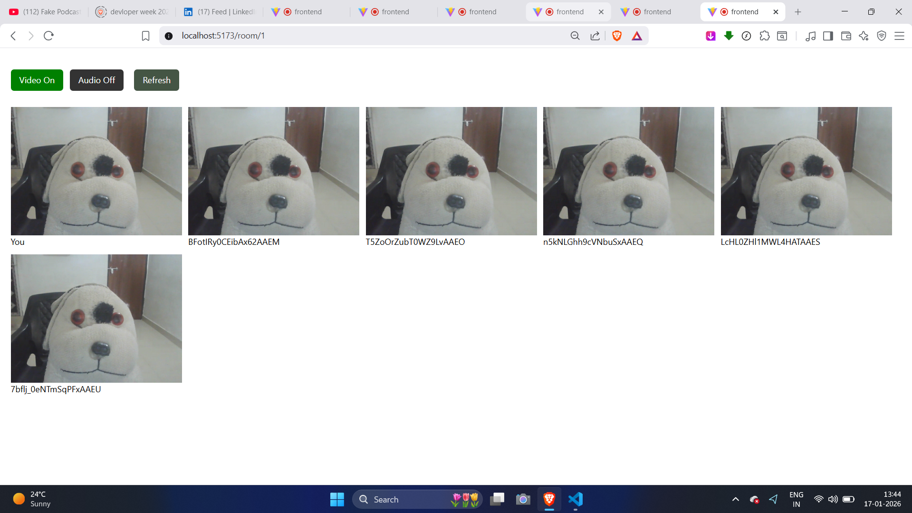

## 🚀 Project Overview

Most basic WebRTC tutorials cover P2P, which struggles with CPU and bandwidth as more people join. This project implements an **SFU** architecture, where:
1. Each participant sends their media to the server **once**.
2. The server forwards those streams to all other participants.
3. This significantly reduces the upload bandwidth and processing power required for each client.

### Key Features
* **SFU Architecture:** Efficient media routing without the heavy CPU cost of transcoding.
* **Scalable Rooms:** Supports multiple participants by managing server-side workers.
* **Real-time Stream Handling:** Low-latency video/audio forwarding.
* **Modern Stack:** Built with Vite, React, and TypeScript.

---

## 📸 Screenshots

### 1. The Lobby
The entry point where users register their details (Name, Email, and Room Number).


### 2. The Video Room
The active call interface managed by the SFU.


---

## 🛠 Tech Stack

* **Frontend:** React.js + Vite (TypeScript)
* **Backend:** Node.js
* **Real-Time Media:** WebRTC
* **Signaling:** Socket.io
* **Architecture:** Selective Forwarding Unit (SFU)

---

## 🏃 Getting Started

To run this project locally, you need to install dependencies for both the frontend and the backend.

1. Clone the repository
```bash
git clone https://github.com/Jitendra-2848/SFU-video-calling-app.git
cd SFU-video-calling-app
```
2. Setup Backend
```bash
cd backend
npm install
npm run dev
```

3. Setup Frontend
Open a new terminal window:
```bash   
cd frontend
npm install
npm run dev
```
4.  Access the app:
    Open your browser and navigate to `http://localhost:3000`.

---
# 🧠 Technical Learnings
Resource Management: Managing CPU threads and worker processes on the server.
WebRTC State Machine: Handling ICE candidates and SDP negotiation in an SFU context.
TypeScript Integration: Ensuring type safety across real-time media streams.


## 🤝 Contributing

Contributions, issues, and feature requests are welcome! Feel free to check the [issues page](https://github.com/Jitendra-2848/SFU-video-calling-app/issues).

## Author
**Developed by [Jitendra Prajapati](https://github.com/Jitendra-2848)**